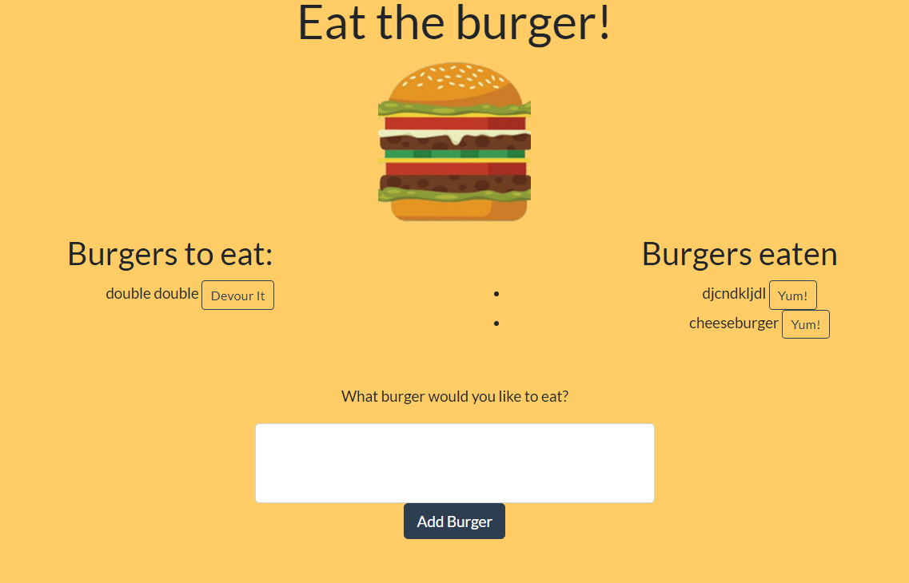

### Burger

In this Burger app, the user is able to type in a burger they would like to eat. Once the submit button is clicked, the burger will be redirected to the "Burgers to eat" list, along with a "Devour It!" button for when the user is ready to consume that burger. Once the user clicks the "Devour It!" button, the burger will be redirected to the "Burgers eaten" list, to show that the burger was eaten.

## Links
* https://young-garden-41918.herokuapp.com
